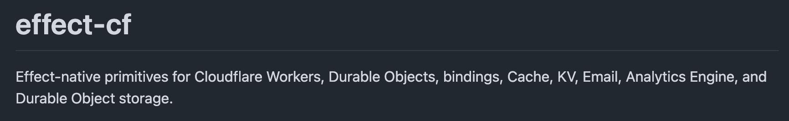
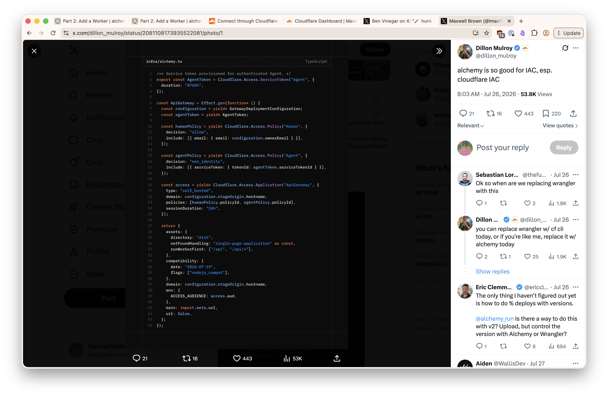

# Alchemy effectifies Cloudflare primitives

Every Cloudflare binding has an expression in Effect. That is the claim worth
testing in Phase 0, because if it holds, infrastructure and runtime stop being
two vocabularies and become one.

## Prior art

[`effect-cf`](https://github.com/danieljvdm/effect-cf/tree/main) is the useful
reference for what "effectified" actually looks like at the primitive level —
Workers, Durable Objects, bindings, Cache, KV, Email, Analytics Engine, and
Durable Object storage, each given an Effect-native surface.



It is a map of the boundary, not a dependency — but it shows where the seams are
before we cut our own.

## The same idea on the infrastructure side

[Dillon Mulroy](https://x.com/dillon_mulroy/status/2081108173935522081/photo/1)
gave a good illustration of the usefulness of Alchemy: a service token, two
Access policies, and an Access application, all declared inside `Effect.gen`,
in the same file that configures the Worker's assets, compatibility flags, and
env.



The point is not that it is terser than Wrangler config. It is that
[with Alchemy we can write Effect code to describe and deploy all Cloudflare
infrastructure](https://x.com/imax153/status/2081323853171556739) — the same
language, the same error channel, the same composition rules as the code that
runs on top of it. This is the concrete payoff of the decision already recorded
in [design.md](../../design.md): Alchemy 2 for both infrastructure and Cloudflare
runtime, one dependency instead of two overlapping ones.

## Local runs are partly real

When running the stack locally, anything that cannot sensibly be emulated is
deployed to Cloudflare for real. You can observe it appearing in the Cloudflare
console. Worth internalising early — "local" here means _mostly_ local, and the
things that escape emulation are exactly the ones with account-level state.

## Proving the cursor

The Phase 1 exit test needs two clients to agree on a position in history, so
the first thing to prove out is that a session can be indexed and that clients
read the same cursor.

`seq` is a monotonically increasing integer, per session, starting at 1. Its job
is to be a **stable address for a position in history** — nothing more. Not a
timestamp, not an ID, not ordering by arrival.

```typescript
const nextSeq = Effect.gen(function* () {
  const previous = (yield* state.storage.get<number>('seq')) ?? 0;
  const seq = previous + 1;
  yield* state.storage.put('seq', seq);
  return seq;
});
```

The cursor has to persist after the Worker has been evicted. That is the actual
assertion: the counter lives in durable storage rather than in-memory state, and
survives beyond a single request. An in-memory `seq++` passes every happy-path
test and fails the only one that matters.
