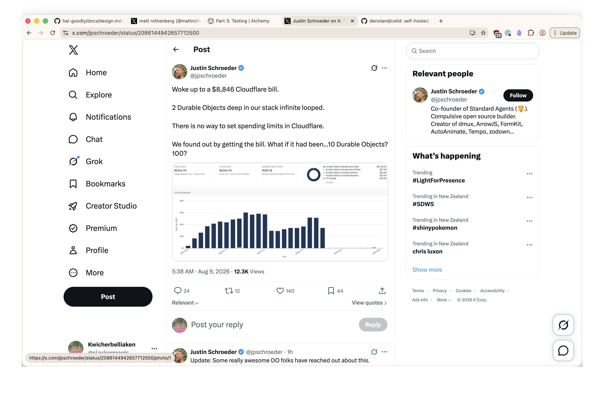

# Alchemy integration tests, and the bill you cannot cap

Alchemy's integration tests are not simulations. [They run against a real
Cloudflare deployment](https://alchemy.run/cloudflare/tutorial/part-3/) — the
whole stack goes up, and the live Worker is reachable over HTTP. That is the
appeal, and it is also the thing to be careful about.

## The harness

The test file declares the providers it needs and gets back a bound `test`,
along with lifecycle helpers that deploy and tear down the stack:

```typescript
const { test, deploy, destroy, afterAll } = Vitest.make({
  providers: Cloudflare.providers(),
  dev: true,
});
```

This is the same shape as the rest of the codebase — `deploy(Stack)` is an
Effect, the tests are `Effect.gen` blocks, and the stack's resolved `url` is
just another value yielded out of the environment. See
[`echo.integration.test.ts`](../../../hal-server/src/echo.integration.test.ts)
for the Phase 0 use of it.

Running it requires a Cloudflare profile and an authenticated session. I logged
in with `npx alchemy login` rather than wiring credentials through the
environment.

`dev: true` keeps the Worker in local workerd instead of pushing it to the edge,
but it does _not_ make the test hermetic. Alchemy still resolves the account
before it plans. This is the same "local is only mostly local" property noted in
[the previous entry](../alchemy-effectifies-cloudflare-primitives/index.md) —
anything with account-level state escapes emulation and becomes real.

## Real deployments have real invoices

[Justin Schroeder woke up to an $8,846 Cloudflare
bill](https://x.com/jpschroeder/status/2086144942657712500). Two Durable Objects
deep in the stack infinite looped. He found out when the bill arrived.



The load-bearing sentence is the third one: **there is no way to set spending
limits in Cloudflare.** No cap, no circuit breaker — the only feedback channel is
billing, and it is monthly.

That is a bad fit for the architecture being built here. Durable Objects that
call each other, alarms that reschedule themselves, a session that appends to its
own log — every one of those is a shape that can loop. Two DOs was enough to
reach nearly nine thousand dollars. And integration tests deploy for real, which
means a runaway loop is reachable from a test run, not just from production.

## What to do about it

Cost alerts in the Cloudflare dashboard are the minimum, and they are detection
after the fact rather than prevention.

The better answer is defensive: code the loop detection into the primitives
themselves. A Durable Object should be able to tell that it is spinning — a
recursion depth or hop count carried across DO-to-DO calls, a bound on how many
times an alarm may reschedule, a stall detector for a session that is writing
without advancing. The `seq` cursor already gives a cheap signal here: history
that grows without the cursor meaning anything new is a loop by another name.

Worth writing down now, while the stack is small enough that adding the guards
is trivial. The failure mode this protects against does not announce itself —
it just arrives as an invoice.
