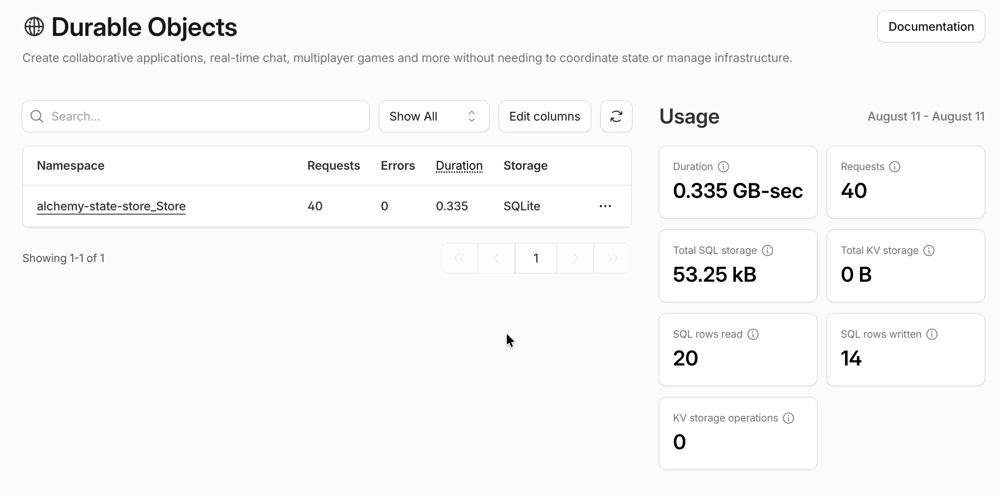
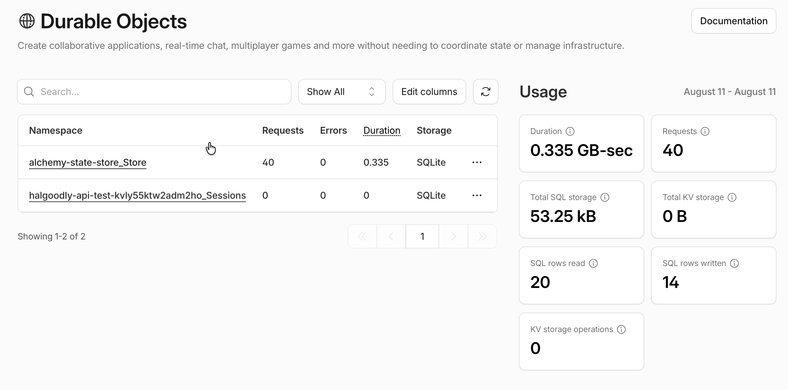

# Where Durable Object state lives in a local run

[The previous entry](../alchemy-integration-tests-and-cloudflare-cost-awareness/index.md)
was about what an integration test costs when it reaches Cloudflare for real.
This one is the other half of the same question: what `dev: true` actually
does, and where the state ends up when it does not go to the edge.

## Local is workerd, and workerd writes to disk

Every Cloudflare resource with a local provider — KV, R2, D1, Queues, Workers
— is emulated on the machine instead of deployed. The choice is made in one
place, and it is one line:

```typescript
onSome: (c) => (c.dev ? ("local" as const) : ("live" as const)),
```

[`ProviderMode.ts`](../../../repos/alchemy/packages/alchemy/src/ProviderMode.ts)
resolves the run-level default; `Alchemy.remote()` is the per-resource opt-out
that forces `"live"` even in dev. The emulator is **workerd** — Cloudflare's
open-source Workers runtime, the same engine that runs on the edge, with the
network and the account taken away.

Storage lives under `.alchemy/local`, resolved once by `localStorageDirectory`
in
[`LocalRuntime.ts`](../../../repos/alchemy/packages/alchemy/src/Cloudflare/LocalRuntime.ts)
so that the runtime layer and any Vite child processes point at the same place.
It is registered as a single workerd disk service and handed to the user worker
as its Durable Object storage:

```typescript
durableObjectStorage: {
  localDisk: storage.name,
},
```

One directory for the whole session, and everything inside it is SQLite. This
is also why a hot reload loses in-memory state: the reload restarts workerd.
That is exactly the property [`Session.ts`](../../../hal-server/src/Session.ts) is
built to prove — `seq` is read and written through `state.storage`, not a
closure variable, so it survives the restart that would erase a counter held in
memory.

Much of this is documented in
[Alchemy's local dev tutorial](https://alchemy.run/cloudflare/tutorial/part-4/).

## Tests are local development wearing a different stage

The integration test uses the same machinery, so the Durable Objects it creates
are also SQLite files on disk. They accumulate, one directory per Worker
instance:


The names are not opaque.
[`createPhysicalName`](../../../repos/alchemy/packages/alchemy/src/PhysicalName.ts)
composes `${stack}-${id}-${stage}-${instanceId}`, so
`halgoodly-api-test-3mwa24rmqef2cnav-Sessions` is the `Api` worker of the
`HalGoodly` stack at stage `test`, suffixed with 80 bits of instance identity,
and then suffixed again with the Durable Object class name. The
`dev-jack-morris` one is the same worker under the local dev stage.

**Every one of those directories is a Worker instance that no longer exists.**
The instance ID is fresh on every create, so each `deploy(Stack)` produces a new
physical name and therefore a brand new storage directory;
`afterAll(destroy(Stack))` tears the stack down and leaves the SQLite behind.
2.3 MB of it so far.

That matters because the test asserts on it. From
[`echo.integration.test.ts`](../../../hal-server/src/echo.integration.test.ts):

```typescript
expect(firstCall.seq).toBe(1);
expect(secondCall.seq).toBe(2);
```

`seq` starting at 1 is not a fact about the Durable Object. It is a fact about
the deploy having been fresh. The file already carries a comment about
isolation *within* a run — each test addresses a different session name,
because two tests sharing one would only pass in declaration order. The
cross-run version of that hazard sits one level up and is not written down: if a
run ever reuses an instance ID — a resumed stack, a destroy that did not
complete — `seq` starts where the last run left it, and the assertion fails
for a reason that has nothing to do with the code under test.

## What is remote regardless

`.alchemy/state/CloudflareStateStore/` is empty, and that is deliberate:
[`alchemy.run.ts`](../../../hal-server/alchemy.run.ts) declares
`Cloudflare.state()`, so there is no local state file to lose or to share. The
state store is a real Durable Object in the account, and it is doing real work
during a local test run — 40 requests, 20 rows read, 14 written, for a test
suite that never left the machine.



Drop `dev` and the picture changes. A second namespace appears — the session
store itself, provisioned for real:



This is the "local is only mostly local" property from
[the first entry](../alchemy-effectifies-cloudflare-primitives/index.md), made
concrete: the resources that escape emulation are the ones with account-level
state, and the state store is unavoidably one of them.

## What it changes

The `seq` assertions should not depend on the deploy having been fresh.
`Session` already exposes a `currentSeq` that nothing calls — reading it first
and asserting the *advance* rather than the absolute value would make the test
say what it means, and would keep passing against a Durable Object that has
lived a life before the assertion runs. That is the honest shape for Phase 1
too, where the cursor is read by clients joining an existing session rather than
a fresh one.

`.alchemy/local` needs an occasional sweep. Nothing prunes it, and a directory
per historical instance is going to make reading that tree harder long before it
makes the disk hurt.

And the state store is worth keeping in view for the reason the last entry gave.
It is a Durable Object taking traffic on every plan and every deploy, including
the local ones, which means it is on the wrong side of the line for a runaway
loop that arrives as an invoice.
